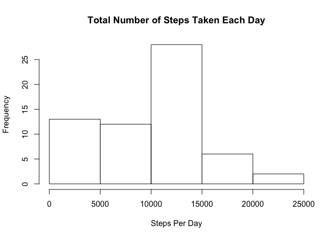
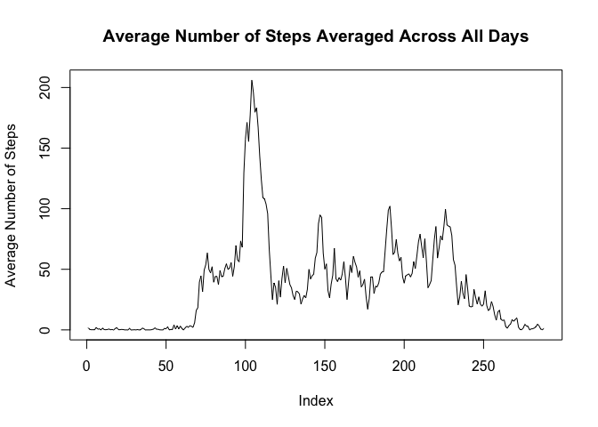
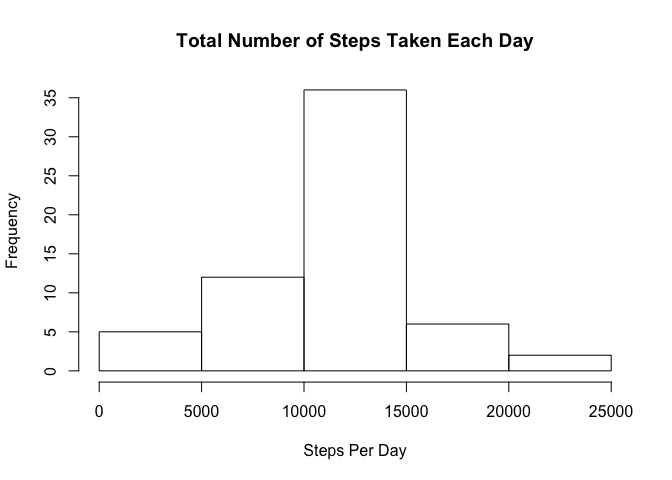
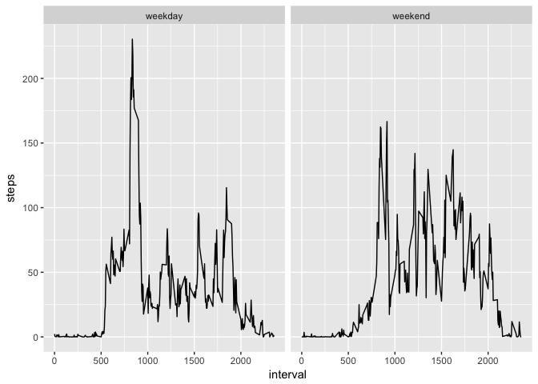

We do some analysis to the data from a personal activity monitoring device. This device collects data at 5 minute intervals through out the day. The data consists of two months of data from an anonymous individual collected during the months of October and November, 2012 and include the number of steps taken in 5 minute intervals each day.

##Loading and preprocessing the data

We first load the data and take a closer look on the variables.


```r
ActMonitoring = read.csv("activity.csv")
head(ActMonitoring)
```

```
##   steps       date interval
## 1    NA 2012-10-01        0
## 2    NA 2012-10-01        5
## 3    NA 2012-10-01       10
## 4    NA 2012-10-01       15
## 5    NA 2012-10-01       20
## 6    NA 2012-10-01       25
```

```r
str(ActMonitoring)
```

```
## 'data.frame':	17568 obs. of  3 variables:
##  $ steps   : int  NA NA NA NA NA NA NA NA NA NA ...
##  $ date    : Factor w/ 61 levels "2012-10-01","2012-10-02",..: 1 1 1 1 1 1 1 1 1 1 ...
##  $ interval: int  0 5 10 15 20 25 30 35 40 45 ...
```

It seems the date variable is in the wrong format, so we transform it into a Date variable.


```r
ActMonitoring$date = as.Date(ActMonitoring$date)
```

##Total Number of Steps Taken per Day

Then, we create a summary vector consisting of the total number of steps taken each day. As there are some NA in the steps variable, we use the sum(...,na.rm = T) as an anonymous function.


```r
StepsPerDay = tapply(ActMonitoring$steps, ActMonitoring$date, function(x) sum(x,na.rm = T))
```

We then report the histogram, mean, and median of this vector.


```r
hist(StepsPerDay, main = "Total Number of Steps Taken Each Day", xlab = "Steps Per Day")
```

<!-- -->

```r
mean(StepsPerDay)
```

```
## [1] 9354.23
```

```r
median(StepsPerDay)
```

```
## [1] 10395
```

##Average Daily Activity Pattern

Next, we create a summary vector consisting of the average number of steps taken in each interval. The averaging is done across all day.


```r
StepsPerInterval = tapply(ActMonitoring$steps, ActMonitoring$interval, function(x) mean(x, na.rm = T))
```

We then plot this as a time-series.


```r
plot(StepsPerInterval,type = "l",main = "Average Number of Steps Averaged Across All Days" , ylab = "Average Number of Steps")
```

<!-- -->

We also return the 5-minutes interval that has the maximum average number of steps.


```r
which.max(StepsPerInterval)
```

```
## 835 
## 104
```
The 5-minutes interval with the maximum average number of steps is the 835 interval. This interval has 104 steps on average.

##Imputing Missing Values

We summarise the number of missing-values for each columns


```r
apply((is.na(ActMonitoring)),2,sum)
```

```
##    steps     date interval 
##     2304        0        0
```

There are 2304 NA rows, all of which has missing number of steps. We replace these missing values with the mean of that 5-minutes interval.


```r
ActivityImputed = ActMonitoring
for (i in which(is.na(ActMonitoring$steps))) {
    ActivityImputed[i,1] = StepsPerInterval[as.character(ActMonitoring[i,3])]
}
```

We check that these really impute the first few NA's with the mean of 5-minutes intervals.


```r
head(StepsPerInterval)
```

```
##         0         5        10        15        20        25 
## 1.7169811 0.3396226 0.1320755 0.1509434 0.0754717 2.0943396
```

```r
head(ActivityImputed)
```

```
##       steps       date interval
## 1 1.7169811 2012-10-01        0
## 2 0.3396226 2012-10-01        5
## 3 0.1320755 2012-10-01       10
## 4 0.1509434 2012-10-01       15
## 5 0.0754717 2012-10-01       20
## 6 2.0943396 2012-10-01       25
```

We create the new total number of steps per day summary and report the new histogram, mean, and median of this vector.


```r
StepsPerDay = tapply(ActivityImputed$steps, ActivityImputed$date, sum)
hist(StepsPerDay, main = "Total Number of Steps Taken Each Day", xlab = "Steps Per Day")
```

<!-- -->

```r
mean(StepsPerDay)
```

```
## [1] 10766.19
```

```r
median(StepsPerDay)
```

```
## [1] 10766.19
```

##Differences in Activity Patterns Between Weekdays and Weekends

Finally, we would like to see the difference between the activity patterns between weekdays and weekends. To do this, we first create a new factor variable indicating whether a given date is a weekday or a weekend day.


```r
library(dplyr)
```

```
## 
## Attaching package: 'dplyr'
```

```
## The following objects are masked from 'package:stats':
## 
##     filter, lag
```

```
## The following objects are masked from 'package:base':
## 
##     intersect, setdiff, setequal, union
```

```r
ActivityImputed = ActivityImputed %>% mutate(day = weekdays(date)) %>% mutate(factor = ifelse(day %in% c("Saturday","Sunday"),"weekend","weekday"))
ActivityImputed$factor = as.factor(ActivityImputed$factor)
```

Then we create a summary table and plot the average number of steps for every 5-minutes averaged across all weekday days or weekend days.


```r
library(reshape2)
library(ggplot2)
ActivityMelt =  melt(ActivityImputed, id = c("interval","factor"), measure.vars = "steps")
ActivityCast = dcast(ActivityMelt, interval + factor ~ variable, mean)
qplot(interval, steps, data = ActivityCast, facets = .~factor, geom = "line")
```

<!-- -->
